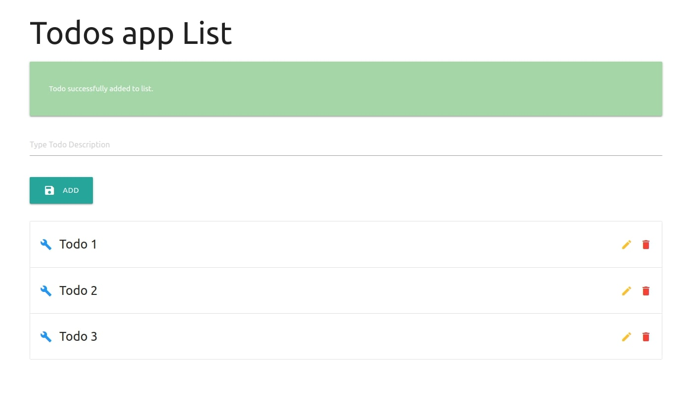
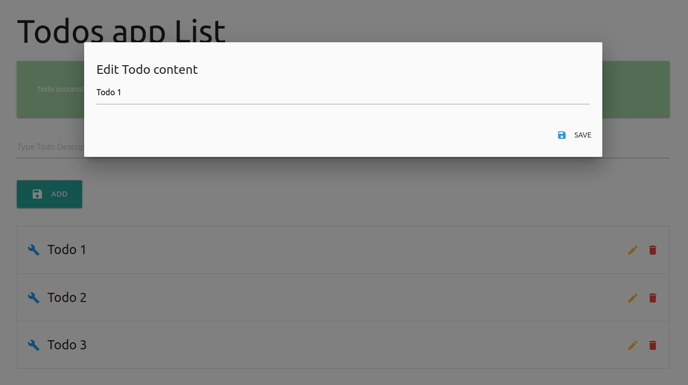
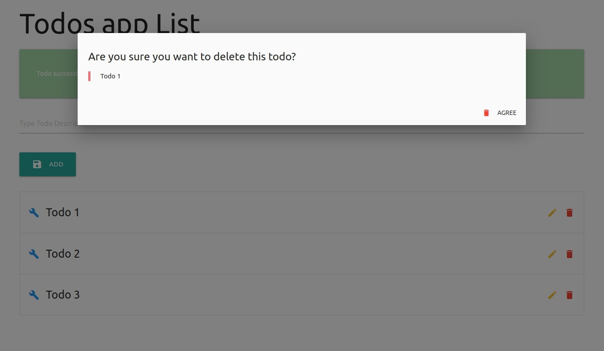

# Antidot Framework - Getting Started App

* PHP ^7.4|^8.0
* Antidot Framework
* Doctrine ORM
* Twig Template Engine

## Getting Started Tutorial

> [getting-started.antidotfw.io](https://getting-started.antidotfw.io/)

Check the step-by-step tutorial on making the getting Started Todo App with Antidot Framework.

## Install

Open console

````bash
git clone git@github.com:antidot-framework/getting-started-app.git
cd getting-started-app
touch var/database.sqlite
composer install
bin/console orm:schema-tool:create
php -S 127.0.0.1:8000 -t public
````




